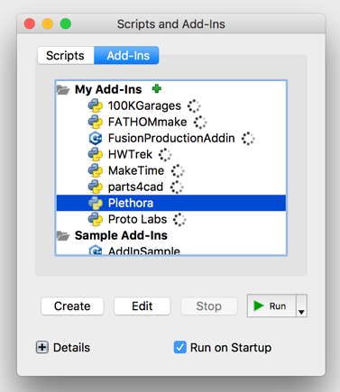

# Plethora Fusion 360 Add-In

This Add-In allows you to analyze and get instant quotes for your parts using [Plethora](https://www.plethora.com), right inside [Autodesk® Fusion 360™](https://www.autodesk.com/products/fusion-360/overview).

_Note: This is an unofficial Plethora Add-In._

_All product names, trademarks and registered trademarks are property of their respective owners. All company, product and service names used in this website are for identification purposes only._

## Installation

1. Download the latest version of the Add-In [here](https://github.com/gravitatedesigns/plethora-fusion360-addin/releases/download/1.0.0/plethora-fusion360-addin.zip).

2. Open Fusion 360 and go to the `Add-Ins` toolbar panel and select `Scripts and Add-Ins…` or press `Shift-S`.

    

3. Select the `Add-Ins` tab and press the plus button next to `My Add-Ins`.

    

4. Find the directory that contains the Add-In that was downloaded in step 1 and select it. After clicking `Open` the Plethora Add-In should now appear under `My Add-Ins`.

    

5. Select the `Plethora` under My Add-Ins and click `Run`.

    

6. The Plethora Add-In should appear in the toolbar panel. Just click on it to start using it!

    

## Development

The following is required to build the HTML portion of the Add-In:

- [Node.js](https://nodejs.org/en/)
- [Vue.js](https://vuejs.org)

Once those are installed there are the following targets that are useful in the `Makefile`:

```bash
make build # Builds the entire Add-In and places the artifacts in build/debug.

make run-web # Serves the web portion of the add-in for development and debugging.
```

To run the Add-In inside of Fusion 360 follow the installation instructions above, but use the `build/debug/plethora` directory instead of downloading the release.

## Known Issues

- Does not support manual quotes.
- Only one part can be analyzed at a time.
- Windows has not be tested, but should run just fine.